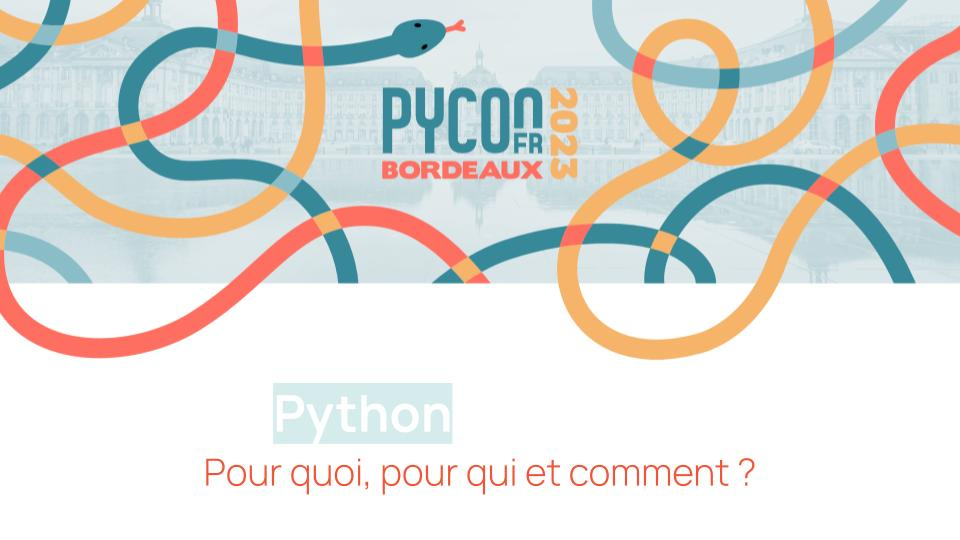

# pyconfr2023

## PyConFR demonstration of PygBag x Harfang 3D

_Pour quoi, pour qui et comment ?_

Talk d'une heure présenté à la PyConFR 2023 à Bordeaux. Un tour d'horizon et historique sur le problème du portage d'applications et une proposition de solution s'appuyant sur Python et WASM.

### Presentation :

 - [PDF Slides](visuels/Portage-Python sur-Webassembly-PyConFR2023.pdf)

### Orateurs : 

- Paul Peny (Pygbag)
- Francois Gutherz (Harfang 3D)

